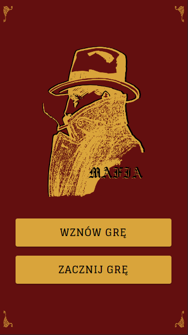
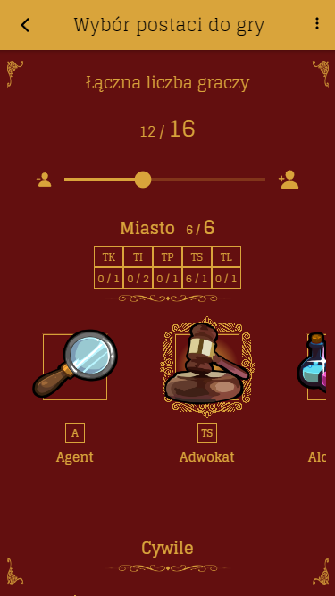
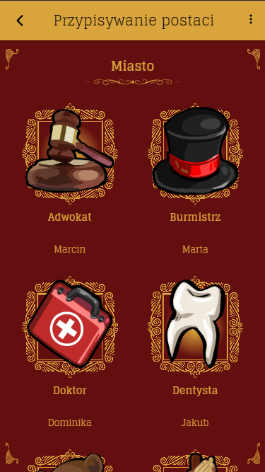
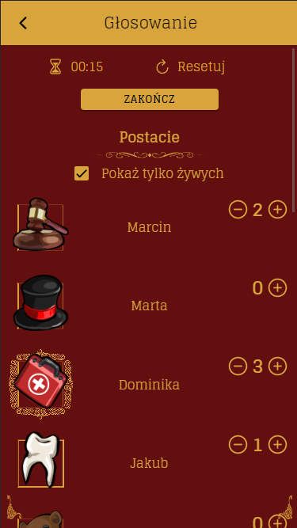
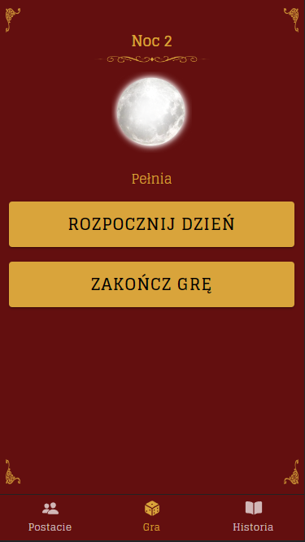

# Mafia

  

  

Mafia jest mobilną aplikacją stworzoną w Ionicu, która ma na celu ułatwienie pracy Game Mastera (GM) w autorskiej adaptacji gry towarzyskiej Mafia. Aplikacja oferuje zestaw narzędzi i funkcji, które pomogą w prowadzeniu rozgrywki, śledzeniu postępów oraz utrzymaniu odpowiedniego tempa gry.

## Wymagania systemowe

Aby korzystać z aplikacji Mafia Companion, potrzebujesz urządzenia mobilnego z systemem Android lub iOS. Docelowo wygenerowana aplikacja nie wymaga dostępu do internetu.

## Instalacja

Obecnie aplikacja Mafia Companion jest w trakcie rozwoju i nie ma jeszcze dostępnej oficjalnej wersji instalacyjnej. Pracujemy nad stworzeniem stabilnej i pełnoprawnej wersji, która będzie gotowa do użytku wkrótce.

## Instrukcja uruchamiania w trybie developerskim

Aby uruchomić aplikację Mafia w trybie developerskim, postępuj zgodnie z poniższymi krokami:

1. Sklonuj repozytorium projektu Mafia Companion na swój lokalny komputer:

    `$ git clone https://github.com/username/mafia-companion.git`

2. Przejdź do katalogu projektu:

    `$ cd mafia-companion`

3. Zainstaluj zależności, używając menedżera pakietów np. npm (Node Package Manager):

    `$ npm install`

4. Uruchamianie aplikacji w trybie developerskim:

    a. W przeglądarce

      `$ npm run start`

    b. Na urządzeniu fizycznym lub emulatorze
  
      `$ ionic cordova run android -l`

      **Uwaga:** Aby wykonać powyższe polecenie należy mieć zainstalowane Android SDK, Java Development Kit (JDK 1.8), Set up the necessary environment variables for the Android SDK and JDK. Skonfiguruj niezbędne zmienne środowiskowe dla `Android SDK`, `JDK` i `JAVA_HOME`.

Po wykonaniu powyższych kroków, aplikacja powinna zostać uruchomiona w przeglądarce internetowej pod adresem [http://localhost:8100](http://localhost:8100) lub na Twoim urządzeniu. Możesz edytować kod aplikacji i na bieżąco widzieć zmiany, ponieważ tryb developerski obsługuje automatyczne odświeżanie.

**Uwaga:** Aby uruchomić aplikację w trybie developerskim, wymagane jest odpowiednie skonfigurowanie środowiska. zainstalowanie Node.js (v18.10.0) oraz Ionic CLI (Command Line Interface v5.4.16).

## Funkcje

### 1. Tworzenie rozgrywki

  
  
  

- **Wybieranie konfiguracji gry i ról, według predefiniowanej logiki**: Aplikacja umożliwia wybór różnych konfiguracji gry, takich jak liczba graczy oraz jakie konkretne role będą mogli oni przyjmować. Logika gry jest zaimplementowana w aplikacji, dzięki czemu możesz łatwo dostosować rozgrywkę do swoich preferencji.
- **Dodawanie uczestników i automatyczne przypisywanie ich do wybranych ról biorących udział w rozgrywce**: Możesz dodawać uczestników do rozgrywki, wprowadzając ich imiona lub pseudonimy. Aplikacja posiada opcję automatycznego przypisania ich do wybranych ról, uwzględniając konfigurację gry.
- **Wybór trybu rozgrywki**: Aplikacja pozwala na wybór trybu gry "incognito", w którym przed rozpoczęciem rozgrywki gracze nie posiadają wiedzy o tym jakie dokładnie postaci biorą udział w rozgrywce, a każdy z nich identyfikowany i przedstawiany jest jako odpowiedni numer.
- **Możliwość zakończenia rozgrywki w każdym momencie i rozpoczęcia nowej**: Aplikacja umożliwia zakończenie aktualnej rozgrywki w dowolnym momencie i rozpoczęcie nowej. To daje GMowi elastyczność i kontrolę nad przebiegiem gry.

### 2. Prowadzenie rozgrywki

  
  

- **Instrukcje dotyczące kart i graczy dla GM**: Aplikacja dostarcza GMowi szczegółowe instrukcje dotyczące poszczególnych faz gry, takich jak noc, dzień, głosowanie itp. Dzięki temu GM może płynnie prowadzić rozgrywkę i zapewnić, że wszyscy gracze rozumieją, co się dzieje.
- **Możliwość przeprowadzania głosowania**: Mafia Companion oferuje narzędzia do przeprowadzania dwuetapowego głosowania między graczami. GM może łatwo zainicjować głosowanie, zbierać głosy od graczy i wyświetlać wyniki.
- **Możliwość eliminacji graczy**: Istnieje możliwość eliminiacji gracza przez GM w dowolnym momencie rozgrywki, po wejściu w kartę jego postaci.
- **Rejestracja zdarzeń**: Aplikacja umożliwia rejestrowanie ważnych zdarzeń podczas rozgrywki, takich jak śmierć gracza, wystąpienie pełni księżyca itp. Dzięki temu GM ma pełny obraz rozwoju gry i może odwołać się do tych informacji w celu podejmowania decyzji.

### 3. Podsumowanie rozgrywki

- **Wyświetlanie całej historii rozgrywki z podziałem na poszczególne dni i fazy**: Mafia zapewnia pełną historię rozgrywki, gdzie można przejrzeć zapisane zdarzenia z poprzednich dni i faz. To umożliwia GMowi dokładne śledzenie przebiegu gry, analizowanie strategii graczy i podsumowanie rozgrywki po jej zakończeniu.

## Kontakt

Jeśli masz pytania, uwagi lub sugestie dotyczące aplikacji, skontaktuj się:

- E-mail: sgdev.services@gmail.com
